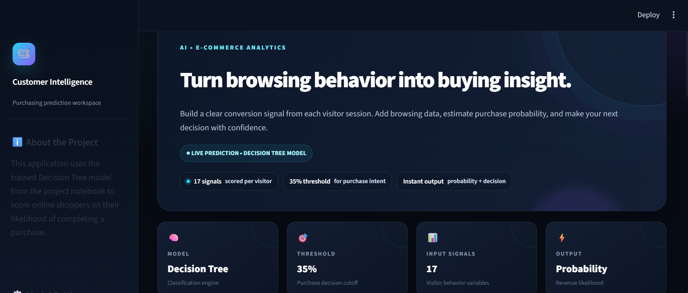
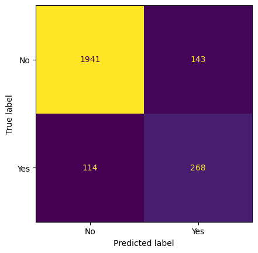
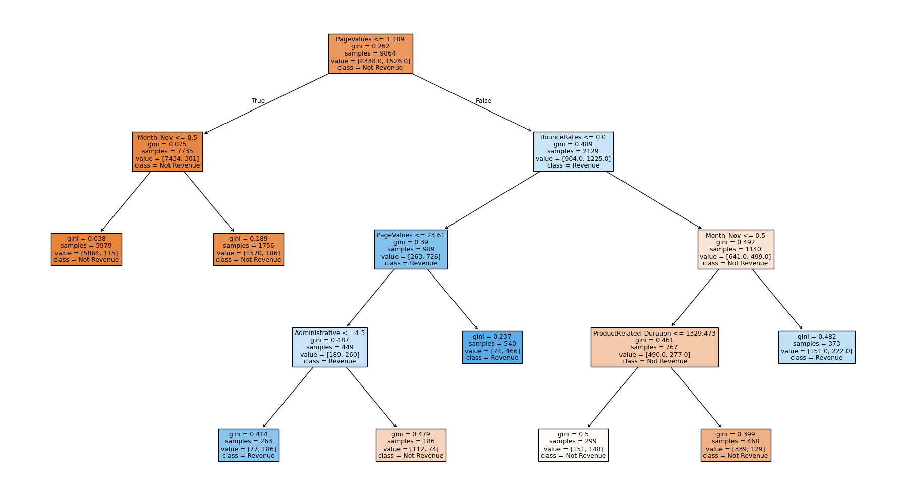
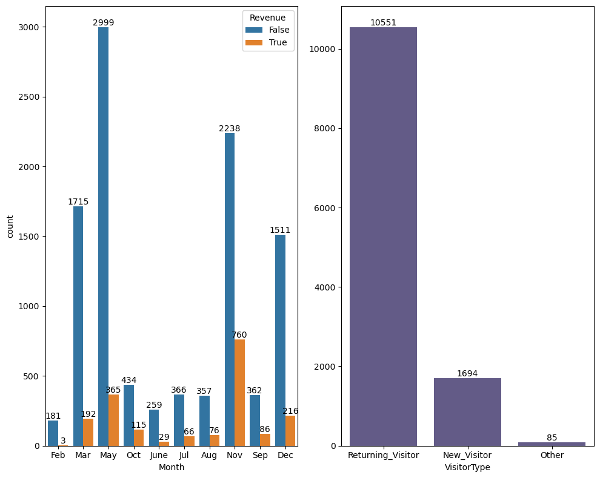
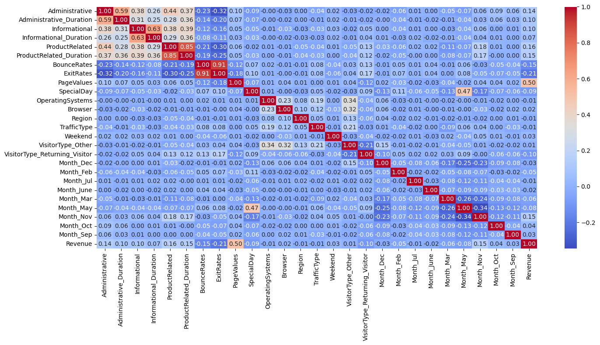

# E-Commerce Customer Purchase Prediction

> Turn visitor browsing behavior into a purchase-intent signal.

[](https://www.python.org/)
[](https://scikit-learn.org/)
[](purchasing_customer_detection_system.ipynb)

## Overview

This project predicts whether an e-commerce visitor is likely to generate revenue from their browsing session. It turns 17 behavioral and session signals into a purchase probability, then applies a **35% decision threshold** to identify likely purchasers.

The model is a tuned and cost-complexity-pruned Decision Tree classifier. The workflow includes exploratory data analysis, categorical encoding, stratified train/test splitting, cross-validated hyperparameter search, threshold selection, evaluation, and export of the trained model and encoder.



## Highlights

| Model | Input signals | Purchase threshold | Test F1 | Test accuracy |
| :-- | --: | --: | --: | --: |
| Decision Tree | 17 | 35% | **0.676** | **0.90** |

- **12,330** visitor sessions, with 18 original columns and no missing values recorded in the notebook.
- **2,466** examples held out for testing using a stratified 80/20 split.
- Best pre-pruning parameters: `max_depth=4`, `min_samples_leaf=1`, and `min_samples_split=10`.
- Cost-complexity pruning selected `ccp_alpha=0.0016835551` by five-fold cross-validation.
- The strongest model signal is **PageValues** (feature importance: 0.848), followed by **BounceRates** (0.079) and **Month_Nov** (0.041).

## Results

At the 35% purchase-probability cutoff, the model prioritizes finding customers who will buy while maintaining strong overall accuracy.

| Actual / predicted | No purchase | Purchase |
| :-- | --: | --: |
| **No purchase** | 1,941 | 143 |
| **Purchase** | 114 | 268 |

For the purchase class, precision is **0.65**, recall is **0.70**, and F1-score is **0.68**.

<p align="center">
  
  
</p>

## Exploratory analysis

The notebook examines revenue distribution and weekend visits, monthly revenue patterns, visitor types, and correlations among the encoded features before fitting the model.

<p align="center">
  
  
</p>

## Workflow

```text
E-commerce sessions
        ↓
Exploratory data analysis
        ↓
Encode VisitorType and Month
        ↓
Stratified 80/20 train/test split
        ↓
Grid search + 5-fold F1 validation
        ↓
Cost-complexity pruning
        ↓
Purchase probability → 35% threshold → prediction
```

## Project structure

```text
.
├── purchasing_customer_detection_system.ipynb  # Analysis, model training, and evaluation
├── shop_smart_ecommerce.csv                    # Session-level e-commerce data
├── model.pkl                                   # Saved Decision Tree model (generated by notebook)
├── encoder.pkl                                 # Saved OneHotEncoder (generated by notebook)
└── README.md
```

## Getting started

### 1. Clone the repository

```bash
git clone https://github.com/MehediNoorNeo/E-Commerce-Customer-Purchase-Prediction.git
cd E-Commerce-Customer-Purchase-Prediction
```

### 2. Create an environment and install dependencies

```bash
python -m venv .venv

# Windows
.venv\Scripts\activate

# macOS / Linux
source .venv/bin/activate

pip install numpy pandas matplotlib seaborn scikit-learn joblib jupyter
```

### 3. Run the notebook

Ensure `shop_smart_ecommerce.csv` is in the notebook's working directory, then launch Jupyter:

```bash
jupyter notebook purchasing_customer_detection_system.ipynb
```

Run all cells to reproduce the analysis and generate `model.pkl` and `encoder.pkl`.

## Modeling details

| Step | Implementation |
| :-- | :-- |
| Target | `Revenue` mapped from boolean to 0/1 |
| Categorical features | One-hot encoding for `VisitorType` and `Month` (`drop="first"`) |
| Split | 80/20, `random_state=42`, stratified by target |
| Hyperparameter search | `GridSearchCV`, 5-fold CV, F1 scoring |
| Class imbalance | `class_weight="balanced"` during pre-pruning search |
| Final decision | `predict_proba` with a 0.35 purchase threshold |

## Notes

- The 35% threshold is intentionally lower than 50% to surface more potential purchasers; adjust it to match the cost of false positives versus missed customers in your use case.
- The saved encoder must be used with the saved model so incoming sessions follow the same feature transformation as the training data.
- The notebook's results are tied to its documented split and random seed.

## Author

Created by [Mehedi Noor](https://github.com/MehediNoorNeo).
